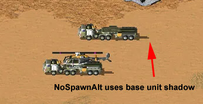

NoSpawnAlt
---
- Version  09:13, 31 March 2025‎ ATHSE

---
If [AltImage](https://modenc.renegadeprojects.com/AltImage) is set on this VehicleType then the vehicle will use a different image when it launches its spawns. Examples include the [Dreadnought](http://cnc.wikia.com/wiki/Dreadnought), [Destroyer](http://cnc.wikia.com/wiki/Destroyer), and [V3 Rocket Launcher](http://cnc.wikia.com/wiki/V3). The image is internally stored in the same memory buffer as the turret so a unit cannot have both a turret and an alternate image.

The [AltImage](https://modenc.renegadeprojects.com/AltImage) filename is derived from the normal [Image](https://modenc.renegadeprojects.com/Image) by suffixing it with WO ("without"). For example, the Destroyer (DEST.vxl) has an alternate image of DESTWO.vxl.

```{warning}
This will cause an [Internal Error](https://modenc.renegadeprojects.com/Internal_Error#eip_6258CC3C) if set on a vehicle that does not have the ability to spawn objects.
```

### Bugs/Side-Effects/Unexpected Limitations

---
Cannot be used with SHP vehicles.

Units always show xxxxxWO.vxl when attacked by [Temporal](https://modenc.renegadeprojects.com/Temporal) weapons.
- This bug has been fixed in Ares 3.0.

The original unit's shadow is displayed even when the spawn has left and the NoSpawnAlt unit is active.
- This bug has been fixed in Phobos Build 39.



### See Also

---
[AltImage](https://modenc.renegadeprojects.com/AltImage)

[Spawns](https://modenc.renegadeprojects.com/Spawns)